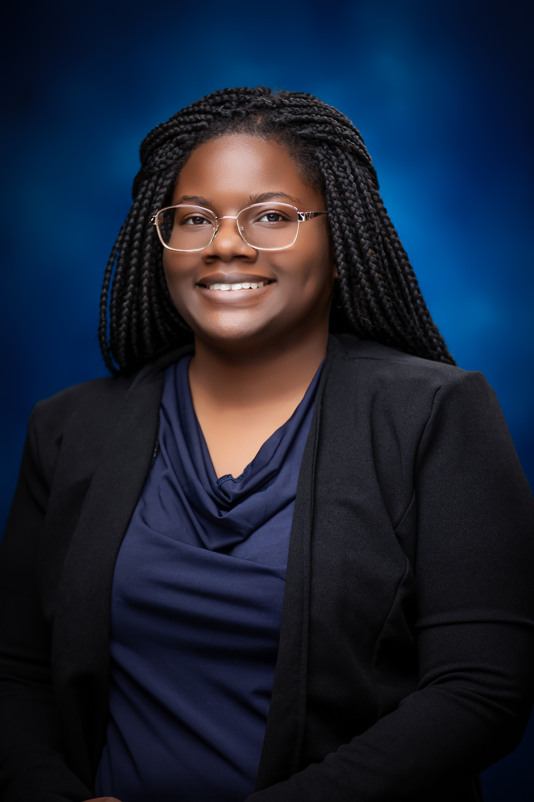

<!DOCTYPE html>
<html lang="en">
<head> 
  <meta charset="UTF-8">
  <meta name="viewport" content="width=device-width, initial-scale=1.0">
  Hard To Cache Team Bios
  <link rel="stylesheet" href="style.css">
</head>
<body style="background: linear-gradient(to bottom right, #dce9f5, #fef5fa); font-family: Arial, sans-serif;">
  <body style="background: linear-gradient(to bottom right, #dce9f5, #fef5fa); font-family: Arial, sans-serif;">
  

    
alt="HardToCache Logo" style="width: 220px;">
  

  

    <section style="text-align: center;">
      
      <h1>Charli Brooks | Aviation & Emergency Management</h1>
      
ִֶָ𓂃 ࣪˖ ִֶָ🐇་༘࿐

      
Aviation Science Major | Emergency Management | Student Pilot

      <h2>About Me</h2>
      
I’m currently studying Aviation Science with a minor in Emergency Management at Elizabeth City State University. With a passion for disaster response, flight operations, and global outreach, I’ve participated in FEMA training, NASA’s L'SPACE Academy, and recently studied abroad in Cannes, France. I bring hands-on leadership experience as a Resident Assistant and CERT Incident Commander, and I’m always seeking new opportunities in aviation and emergency response.

      <h3>Professional Highlights</h3>
      <ul>
        <li>Resident Assistant – ECSU Housing and Residence Life</li>
        <li>CERT Incident Commander – FEMA & University of Utah Trained</li>
        <li>Operations Manager – ECSU Drone Expo & Aviation Summit</li>
        <li>Study Abroad Ambassador – AIFS Abroad (Cannes, France)</li>
        <li>Participant – NASA L'SPACE Mission Concept Academy</li>
      </ul>
      
Email: cnbrooks04@gmail.com Phone: (678) 510-3454 LinkedIn: <a href="https://www.linkedin.com/in/charli7" target="_blank">linkedin.com/in/charli7</a>

    </section>
    

    <section style="text-align: center;">
      
      <h2>Silas Erving</h2>
      
Hey! My name is Silas Erving — I’m a rising junior Software Engineering major at Morehouse College from Charlotte, North Carolina. As a Leo, I see the lion as my spirit animal: confident, curious, and always ready to lead. That mindset drives me in and outside of the classroom. At Morehouse, I’ve been committed to building a strong foundation in computer science, with a growing focus on High-Performance Computing (HPC) and science gateways.

      
I’m passionate about pushing the boundaries of what I can do in tech. Whether it’s learning new programming languages, contributing to student leadership, or participating in summer institutes like SGX3, I’m always looking to grow. I bring a blend of technical skills — like C++, Python, and version control — with a collaborative spirit and a drive to make meaningful impact.

      
Long term, I aspire to be part of teams that design scalable, innovative technology that improves access, connection, and quality of life — especially in underrepresented communities.

      
LinkedIn: <a href="https://www.linkedin.com/in/" target="_blank">www.linkedin.com/in/</a>

    </section>
    

    <section style="text-align: center;">
      
      <h2>Chante Ray</h2>
      
Chante Ray is a dedicated and driven Computer Science major at Mississippi Valley State University, pursuing a Bachelor of Science degree with a minor in Business Administration. She is expected to graduate in May 2026.

      
Chante has demonstrated a commitment to academic excellence, consistently earning recognition on the Dean’s List and as a Scholar. Her coursework spans Computer Programming, Java, Cybersecurity, and Database Management.

      
In addition to her technical expertise, Chante is proficient in Microsoft Office tools and excels in communication and active listening.

      
Her experience includes impactful roles such as Lead Navigator at the Mississippi Center for Justice and Resident Assistant at the Arkansas Summer Research Institute.

      
She’s also an active leader in Phi Theta Kappa, Women in Science and Technology (Treasurer), and the MCIS Club (Treasurer).

    </section>
    

    <section style="text-align: center;">
      
      <h2>Seth Mack</h2>
      
👋 Hi, I’m @SethMack611 
      👀 I’m interested in ... 
      🌱 I’m currently learning ... 
      💞️ I’m looking to collaborate on ... 
      📫 How to reach me ...

    </section>
  

</body>
</html>
